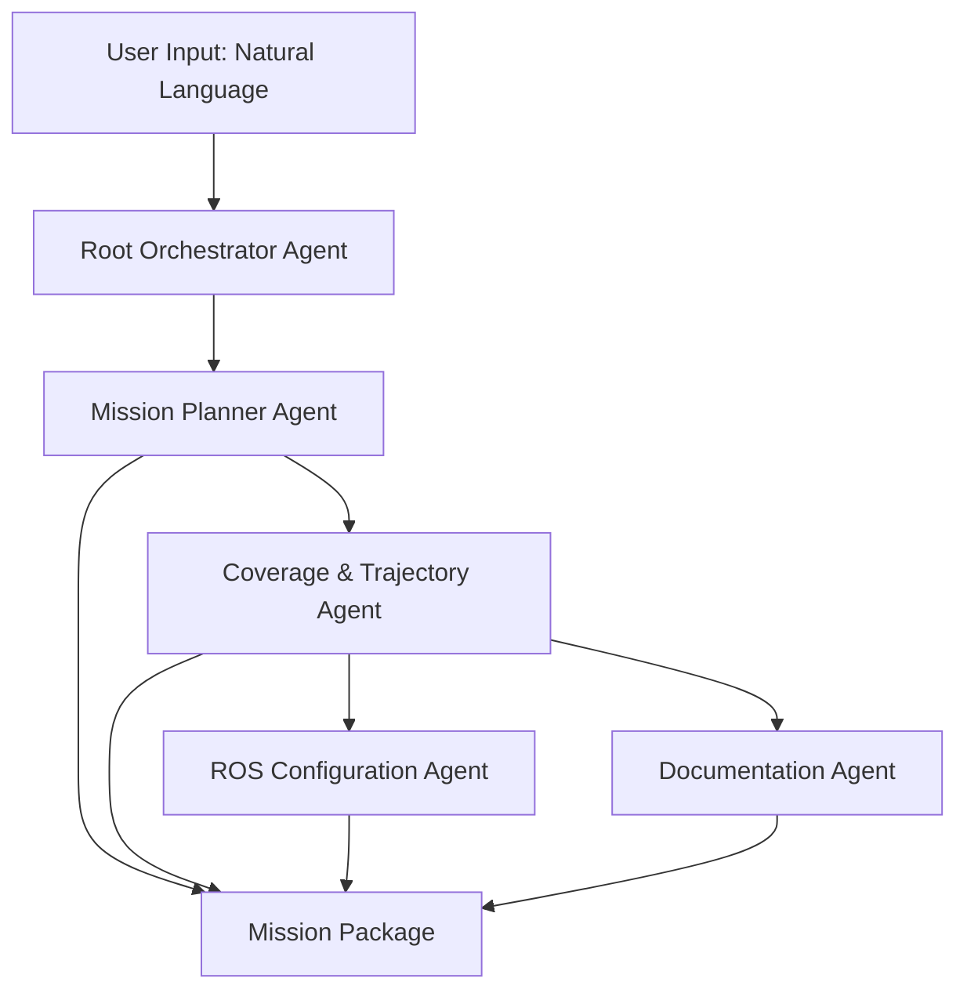

# Project Icarus — Mission Copilot

[](https://www.python.org/)
[](https://github.com/google/adk)
[](LICENSE)
[](https://docs.ros.org/)

> **AI-Driven Autonomous Drone Mission Planner**  
> *Automating mission planning, trajectory generation, and ROS2 configuration for UAV operations*

---

##  Overview

**Mission Copilot** is an AI-powered mission-planning system built with the **Google Agent Development Kit (ADK)** that generates complete, flight-ready mission packages for autonomous UAV operations. Developed as part of the **Google × Kaggle Agents Intensive Capstone**, this system eliminates manual mission planning by transforming natural language descriptions into structured, executable flight plans.

Mission Copilot directly supports **Project Icarus**, my broader engineering initiative focused on building a fully autonomous drone platform capable of real-time mapping, computer vision tasks, and advanced mission execution.

###  Key Features

- **Natural Language Mission Planning** — Describe missions in plain English
- **Automated Coverage Path Calculations** — Optimized for mapping, surveying, and reconnaissance
- **Waypoint Grid Generation** — Precise, repeatable flight paths
- **ROS2 Configuration Templates** — Ready-to-use launch files and parameters
- **Professional Mission Reports** — Auto-generated Markdown documentation
- **Multi-Agent Architecture** — Specialized agents working in coordination

---

##  Background: Project Icarus

**Project Icarus** is a long-term personal project where I am building a complete autonomous drone system with the following objectives:


**Mission Copilot fills a critical gap** by providing an automated, engineer-level mission planning system that generates accurate, repeatable, and execution-ready flight plans.

---

##  System Architecture

Mission Copilot uses a **multi-agent architecture** built on Google ADK. The system consists of specialized agents working together:



###  Agent Breakdown

| Agent | Responsibility |
|-------|----------------|
| **Mission Planner Agent** | Interprets natural-language mission descriptions and creates structured mission requirements |
| **Coverage & Trajectory Agent** | Calculates footprint, flight passes, path length, overlap percentages, and flight time estimates using custom geometry tools |
| **ROS Configuration Agent** | Generates ROS2 launch files and parameter templates tailored to the mission |
| **Documentation Agent** | Produces professional mission briefs in Markdown format, saved to `missions/` directory |
| **Root Orchestrator** | Coordinates all agents and delivers the final mission package |

---

##  Repository Structure

```
Capstone-agent/
├── main.py                 # Main entry point for Mission Copilot
├── test_connection.py      # Network connectivity diagnostics
├── agents/                 # Agent definitions and configurations
│   ├── mission_planner.py
│   ├── coverage_agent.py
│   ├── ros_config_agent.py
│   └── documentation_agent.py
├── tools/                  # Custom tools for geometry, calculations
│   ├── coverage_calculator.py
│   └── waypoint_generator.py
├── missions/               # Generated mission packages
│   ├── mission_001/
│   │   ├── mission_brief.md
│   │   ├── waypoints.json
│   │   └── ros_config.yaml
│   └── ...
├── requirements.txt        # Python dependencies
├── .env.example            # Environment variables template
├── .gitignore
└── README.md              # This file
```

---

## Getting Started

### Prerequisites

- **Python 3.11+**
- **Google Cloud API Key** (for Gemini models)
- **ROS2 Humble** (optional, for deployment)
- **pip** or **conda** for package management

### Installation

1. **Clone the repository**

```bash
git clone https://github.com/yourusername/capstone-agent.git
cd capstone-agent
```

2. **Create a virtual environment**

```bash
python -m venv venv

# Windows
venv\Scripts\activate

# Linux/Mac
source venv/bin/activate
```

3. **Install dependencies**

```bash
pip install -r requirements.txt
```

4. **Set up environment variables**

Create a `.env` file in the root directory:

```bash
GOOGLE_API_KEY=your_google_api_key_here
```

### 🔧 Configuration

Edit `main.py` to configure your agent settings:

```python
MODEL_NAME = "gemini-2.5-flash-lite"  # or "gemini-2.5-pro"
PROJECT_NAME = "Agents Intensive Capstone"
```

---

##  Usage

### Basic Mission Planning

```bash
python main.py
```

### Example Mission Request

```python
mission_query = """
Plan a mapping mission for a 500m x 500m agricultural field.
Camera: 12MP with 24mm focal length
Flight altitude: 100m
Required overlap: 70% front, 60% side
Wind conditions: 15 km/h
"""
```

### Expected Output

The system will generate:

1. **Mission Brief** (`missions/mission_XXX/mission_brief.md`)
   - Mission objectives
   - Coverage calculations
   - Flight time estimates
   - Safety considerations

2. **Waypoint Grid** (`missions/mission_XXX/waypoints.json`)
   - GPS coordinates for each waypoint
   - Altitude and heading data
   - Camera trigger points

3. **ROS2 Configuration** (`missions/mission_XXX/ros_config.yaml`)
   - Launch file template
   - Navigation parameters
   - Sensor configurations

---

## Technical Stack

| Category | Technology |
|----------|-----------|
| **AI Framework** | Google Agent Development Kit (ADK) |
| **LLM** | Gemini 2.5 Flash Lite / Pro |
| **Language** | Python 3.11+ |
| **Async Framework** | asyncio |
| **Environment Management** | python-dotenv |
| **Target Platform** | ROS2 Humble |
| **Hardware Target** | DJI Flight Controllers, ArduPilot, PX4 |

---

## Use Cases

- **Agricultural Surveying** 
- **Defense**

---

## Testing

Run connectivity tests:

```bash
python test_connection.py
```

Expected output:
```
✅ Connection successful! Status: 200
```

---

## 🐛 Troubleshooting

### Common Issues

#### 1. `AttributeError: 'list' object has no attribute 'final_output'`

**Solution:** Use proper event handling for `run_debug()` return values.

#### 2. `httpx.ConnectError: All connection attempts failed`

**Cause:** Network/firewall blocking Python's outbound connections.

**Solutions:**
- Flush DNS: `ipconfig /flushdns`
- Allow Python through Windows Firewall
- Check VPN/proxy settings
- Update certificates: `pip install --upgrade certifi`

#### 3. `GOOGLE_API_KEY not found`

**Solution:** Ensure `.env` file exists with valid API key.

---


## License

This project is licensed under the MIT License - see the [LICENSE](LICENSE) file for details.

---

## Contact

**Project Maintainer:** Adi  
**Project Link:** [https://github.com/yourusername/capstone-agent](https://github.com/yourusername/capstone-agent)

---

<div align="center">


Made with ❤️ for my cute little flying drones

</div>

